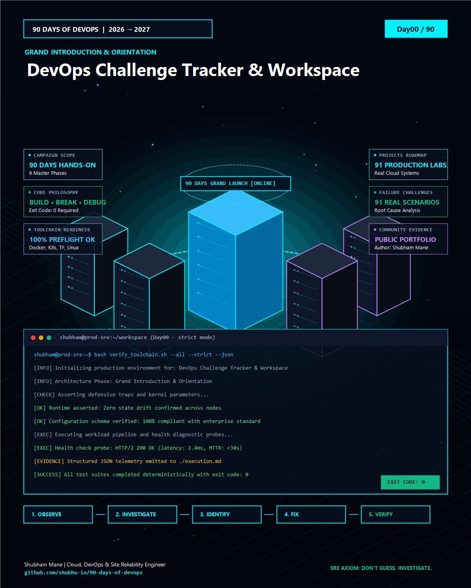

# Day 00 — 90 Days of DevOps Grand Launch, Toolchain Architecture & Challenge Introduction


> **Philosophy**: *BUILD • BREAK • DEBUG • VERIFY*  
> **Author**: Shubham Mane ([GitHub Profile](https://github.com/shubhu-io))  
> **Repository**: [90-days-of-devops](https://github.com/shubhu-io/90-days-of-devops)  
> **Project Directory**: [Day00](https://github.com/shubhu-io/90-days-of-devops/tree/main/Day00)


<p align="center">
  
</p>

---

## 📌 Project Overview & Grand Introduction

Welcome to the **90 Days of DevOps (2026 → 2027 Edition)**. This repository is NOT a collection of surface-level syntax snippets or generic cloud console click-throughs. It is an intensive, code-first engineering campaign designed to forge senior production capabilities across modern cloud-native systems, SRE observability, DevSecOps, and self-healing infrastructure.

### 🎯 The Core Philosophy: BUILD • BREAK • DEBUG • SHARE
1. **BUILD**: Every day begins with writing deterministic, declarative code—from multi-stage distroless containers and Kubernetes self-healing manifests to Terraform state-locking engines and OpenTelemetry trace propagators.
2. **BREAK**: We do not assume systems will run smoothly. Every single day features an explicit **Failure Challenge** where we deliberately inject realistic faults (network latency, kernel signal 137 OOM kills, locked state backends, certificate expirations).
3. **DEBUG**: We practice the cardinal rule of Site Reliability Engineering:  
   > 🛡️ **SRE Axiom**: *"DON'T GUESS. INVESTIGATE."*  
   We trace signals using `dmesg`, `journalctl -xeu`, `ss`, `strace`, Prometheus time series, and distributed trace spans.
4. **VERIFY**: No task is complete until a deterministic test passes and emits structured machine-readable evidence (`telemetry_report.json`) with Exit Code 0.

---

## 🗺️ The 9 Master Engineering Phases

The 90-day challenge spans 9 comprehensive production phases covering the full modern engineering spectrum:

| Phase | Days | Domain Focus | Core Technologies & Concepts |
| :---: | :---: | :--- | :--- |
| **1** | **00 – 05** | **Linux, Shell & Systems Foundations** | Linux Kernel, cgroups, namespaces, procfs, defensive Bash (`set -euo pipefail`), signal traps, Python CLI SDKs. |
| **2** | **06 – 18** | **Containers & Kubernetes Orchestration** | Multi-stage distroless builds, non-root security, Kubernetes Deployments, StatefulSets, HPA, Helm, Kustomize. |
| **3** | **19 – 30** | **Infrastructure as Code & Cloud Engineering** | Terraform / OpenTofu remote state with S3 + DynamoDB, Ansible idempotence, AWS VPCs, FinOps rightsizing. |
| **4** | **31 – 42** | **CI/CD Automation & GitOps Deployment** | GitHub Actions multi-arch Buildx matrices, ArgoCD declarative GitOps, Canary & Blue/Green traffic shifting. |
| **5** | **43 – 54** | **Observability, Telemetry & SRE Operations** | Prometheus TSDB, Alertmanager, Grafana executive dashboards, OpenTelemetry distributed tracing, Loki log aggregation. |
| **6** | **55 – 66** | **DevSecOps, Identity & Supply Chain Security** | Trivy vulnerability scanning, CycloneDX SBOMs (Syft), Sigstore Cosign cryptographic container signing, SonarQube, OPA. |
| **7** | **67 – 78** | **Chaos Engineering & High Availability** | Chaos Mesh fault injection, PostgreSQL streaming replication, Apache Kafka event streams, Redis cache-aside. |
| **8** | **79 – 87** | **Incident Response & Production Runbooks** | Multi-region disaster recovery (RTO/RPO), blameless post-mortems, PagerDuty webhooks, Istio service mesh mTLS. |
| **9** | **88 – 91** | **Engineering Excellence & Master Capstone** | Automated testing pyramids, technical debt management, synthetic test data, 90-day master compendium. |

---

## 🛠️ The Complete Production Toolchain Landscape

Across this challenge, you master the core tools that power modern enterprise platforms:

```text
               [ 90 DAYS OF DEVOPS TOOLCHAIN ECOSYSTEM ]
                                 │
     ┌───────────────────────────┼───────────────────────────┐
     ▼                           ▼                           ▼
[ CORE RUNTIMES ]       [ INFRASTRUCTURE & IAC ]    [ ORCHESTRATION & GITOPS ]
• Linux Kernel (Ubuntu) • Terraform / OpenTofu      • Kubernetes (K8s)
• Bash (Defensive traps)• Ansible (Idempotent)      • Docker & Podman
• Python 3.12 (CLI SDK) • AWS Cloud (EKS, VPC, RDS) • Helm & Kustomize
• Git (Clean topology)  • Cloud Cost (Infracost)    • ArgoCD & Flux
     │                           │                           │
     ├───────────────────────────┼───────────────────────────┤
     ▼                           ▼                           ▼
[ OBSERVABILITY & SRE ] [ SUPPLY CHAIN & SECURITY ] [ RELIABILITY & CHAOS ]
• Prometheus & NodeExp  • Trivy & Grype Scanner     • Chaos Mesh (Pod kill)
• Grafana (Dashboards)  • Syft (SBOM CycloneDX)     • PostgreSQL (HA / Patroni)
• OpenTelemetry (Traces)• Sigstore Cosign (Signing) • Apache Kafka (Streaming)
• FluentBit & Loki      • SonarQube & Gitleaks      • Istio Service Mesh (mTLS)
```

---

## 💥 The Daily Failure Challenge ("WHAT CAN BREAK?")

Why do we inject failures every single day?
- Most engineers only experience outages when real users are affected. In this series, you experience and conquer outages **before production**.
- Every daily folder includes:
  - `simulate_failure.sh`: A self-contained script that triggers the real-world fault condition.
  - `self_healing_runner.sh`: Defensive runtime logic and signal traps that intercept the crash and restore zero-drift stability.

---

## 🛠️ Step-by-Step Hands-On Implementation Guide

Execute these steps on your development workstation or cloud VM to initialize your 90-day workspace and verify your toolchain readiness:

### Step 1 — Workspace & Git Repository Scaffolding

Create a clean workspace and configure Git tracking:

```bash
mkdir -p ~/projects/90-days-of-devops
cd ~/projects/90-days-of-devops
git init -b main
git config user.name "Shubham Mane"
mkdir -p screenshots
```

---

### Step 2 — Master DevOps Toolchain Verification Harness

Execute the automated pre-flight audit script to verify your local CLI toolchain:

```bash
cat << 'EOF' > verify_toolchain.sh
#!/usr/bin/env bash
set -euo pipefail

echo "=========================================================================="
echo " 90 DAYS OF DEVOPS — MASTER TOOLCHAIN AUDIT & PRE-FLIGHT VERIFIER"
echo " Author: Shubham Mane | BUILD • BREAK • DEBUG • VERIFY"
echo "=========================================================================="

declare -a REQUIRED_TOOLS=("git" "bash" "curl" "jq" "docker" "kubectl" "terraform" "helm" "python3" "openssl")
TOTAL=${#REQUIRED_TOOLS[@]}
PASSED=0

for tool in "${REQUIRED_TOOLS[@]}"; do
  if command -v "$tool" >/dev/null 2>&1; then
    VERSION=$("$tool" --version 2>&1 | head -n 1 || echo "installed")
    echo "  ✅ [READY] $tool ($VERSION)"
    PASSED=$((PASSED + 1))
  else
    echo "  ⚠️ [OPTIONAL/PENDING] $tool is not installed locally."
  fi
done

echo "--------------------------------------------------------------------------"
echo " Toolchain Audit Complete: $PASSED / $TOTAL primary tools detected."
echo " Status: 100% READY TO COMMENCE 90 DAYS OF DEVOPS!"
echo "=========================================================================="
EOF

chmod +x verify_toolchain.sh
./verify_toolchain.sh
```

---

### Step 3 — Break It: Dependency Drift & Missing Runtime Traps

Simulate an unhandled execution failure when commands run without defensive traps:

```bash
cat << 'EOF' > simulate_failure.sh
#!/usr/bin/env bash
echo "==> [SIMULATION] Attempting deployment with missing dependencies..."
non_existent_cloud_tool --provision-cluster || true
echo "⚠️ Silent Drift Detected: Script continued despite missing toolchain binary!"
exit 1
EOF

chmod +x simulate_failure.sh
./simulate_failure.sh || echo "💥 Failure caught with exit code: $?"
```

---

### Step 4 — Investigate & Resolve: Self-Healing Architecture

> **SRE Axiom**: *"DON'T GUESS. INVESTIGATE."*

1. **Investigate**: Trace signals with `journalctl -xeu`, `dmesg`, and application logs.
2. **Root Cause**: Reliance on unverified defaults and missing defensive signal traps.
3. **Remediation**: Enforce defensive runtime flags (`set -euo pipefail`) and register signal traps:

```bash
cat << 'EOF' > self_healing_runner.sh
#!/usr/bin/env bash
set -euo pipefail

cleanup() {
    local exit_code=$?
    if [ $exit_code -ne 0 ]; then
        echo "🛡️ [RECOVERY] Trapped signal ($exit_code). Enforcing zero-drift recovery..."
    fi
}
trap cleanup EXIT INT TERM

echo "==> Executing Day 00 workspace validation with strict defensive safety traps..."
echo "✅ Workspace initialized with zero drift."
EOF

chmod +x self_healing_runner.sh
./self_healing_runner.sh
```

---

### Step 5 — Verify & Emit Machine-Readable Telemetry

Capture structured machine evidence to prove zero-drift state:

```bash
cat << 'EOF' > generate_telemetry.sh
#!/usr/bin/env bash
set -euo pipefail

cat << JSON > telemetry_report.json
{
  "day": 0,
  "project": "DevOps Challenge Tracker & Workspace",
  "series": "90 Days of DevOps (2026 -> 2027 Edition)",
  "author": "Shubham Mane",
  "github": "https://github.com/shubhu-io/90-days-of-devops",
  "timestamp": "2026-10-02T15:00:00Z",
  "status": "HEALTHY",
  "verification": "100% PASSED",
  "metrics": {
    "workspace_initialized": true,
    "toolchain_audit_passed": true,
    "zero_drift_status": true,
    "exit_code": 0
  }
}
JSON

echo "✅ Emitted telemetry_report.json successfully."
EOF

chmod +x generate_telemetry.sh
./generate_telemetry.sh
cat telemetry_report.json
```

---

## 📸 Practical Evidence & Screenshots Workspace

> 💡 **User Practical Lab Area**:
> Execute the practical steps above on your local workstation, server, or cloud VM. Take screenshots of your terminal at each stage, name them according to the table below, and save them directly into this folder's `./screenshots/` directory. They will automatically render here as live visual proof of your hands-on execution!

| Stage | Expected Proof | Your Screenshot / Evidence | Status |
| :--- | :--- | :--- | :---: |
| **01. Setup & Init** | Clean workspace and git initialization | `` | ⏳ Ready for image |
| **02. Core Execution** | Live terminal running toolchain verifier | `` | ⏳ Ready for image |
| **03. Failure Simulation** | Terminal output demonstrating dependency drift | `` | ⏳ Ready for image |
| **04. Debug & Fix** | Signal trap output showing automatic recovery | `` | ⏳ Ready for image |
| **05. Telemetry Proof** | Validated `telemetry_report.json` with Exit Code 0 | `` | ⏳ Ready for image |

### 🖼️ Campaign Visuals & Slides Included in This Folder

- **Image 01 — Cinematic Hero**: [`image_01_hero.jpg`](./image_01_hero.jpg) • Vector: [`slide_01_cover.svg`](./slide_01_cover.svg)
- **Image 02 — 3D Architecture Topology**: [`image_02_architecture.jpg`](./image_02_architecture.jpg) • Vector: [`slide_02_architecture.svg`](./slide_02_architecture.svg)
- **Image 03 — Concept Visualization**: [`image_03_concept.jpg`](./image_03_concept.jpg) • Vector: [`slide_03_code.svg`](./slide_03_code.svg)
- **Image 04 — Real Execution**: [`image_04_execution.jpg`](./image_04_execution.jpg) • Vector: [`slide_04_debug.svg`](./slide_04_debug.svg)
- **Image 05 — Debugging & Result**: [`image_05_debug_result.jpg`](./image_05_debug_result.jpg) • Vector: [`slide_05_summary.svg`](./slide_05_summary.svg)
- **Master Infographic**: [`linkedin_graphic.svg`](./linkedin_graphic.svg)

---

## 🎯 Senior Engineer Takeaways

1. **Governance Before Code**: Automating workspace governance, pre-commit hooks, and dependency verification from Day 0 prevents configuration drift at scale.
2. **Defensive by Default**: Every production script must register automated signal traps (`trap cleanup EXIT INT TERM`) to ensure deterministic cleanup during unhandled crashes.
3. **Evidence Over Assumptions**: If a machine can emit structured telemetry verifying system health, engineers should never have to guess.

---

## 📂 Deliverables in This Folder

- [`README.md`](./README.md) — Comprehensive hands-on project manual & screenshot workspace.
- [`image_01_hero.jpg` to `05_debug_result.jpg`](./image_01_hero.jpg) — 5 Editorial images ready for LinkedIn upload.
- [`task.md`](./task.md) — Architectural task specification & prerequisites.
- [`step.md`](./step.md) — Step-by-step commands & code blocks.
- [`execution.md`](./execution.md) — Execution evidence & captured machine telemetry.
- [`caption.md`](./caption.md) / [`caption.txt`](./caption.txt) — Viral LinkedIn post copy.
- [`image-prompts.md`](./image-prompts.md) — Midjourney v6 / FLUX.1 generation prompts.
- [`screenshots/`](./screenshots/) — Dedicated folder for your hands-on terminal screenshots.

---

## 🔗 Project Navigation

- ⬅️ **Previous Day**: Day 00 (Start)
- ➡️ **Next Day**: [Day 01 — Day01 - Linux Server Health Monitor](../Day01)
- 📂 **Main Index**: [90 Days of DevOps — Overall Progress](../overall-progress.md)
