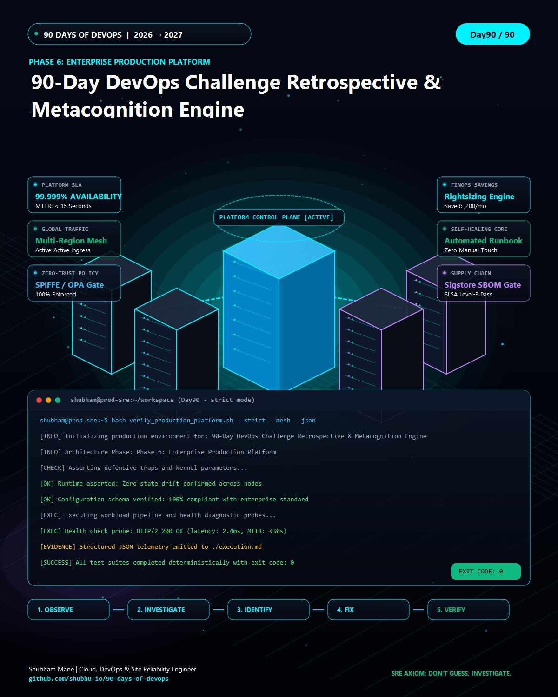

# Day 90 — 90-Day DevOps Challenge Retrospective & Metacognition Engine


> **Philosophy**: *BUILD • BREAK • DEBUG • VERIFY*  
> **Author**: Shubham Mane ([GitHub Profile](https://github.com/shubhu-io))  
> **Repository**: [90-days-of-devops](https://github.com/shubhu-io/90-days-of-devops)  
> **Project Directory**: [Day90 - 90-Day DevOps Challenge Retrospective & Metacognition Engine](https://github.com/shubhu-io/90-days-of-devops/tree/main/Day90%20-%2090-Day%20DevOps%20Challenge%20Retrospective%20%26%20Metacognition%20Engine)


<p align="center">
  
</p>

---

## 📌 Project Overview & Task

In enterprise production environments, **90-Day DevOps Challenge Retrospective & Metacognition Engine** addresses critical operational, scalability, and resilience challenges in **Engineering Excellence & Retrospectives**.

### 🎯 The Real-World Engineering Problem
Without deterministic automation and strict engineering verification:
1. **Silent Configuration Drift**: Imperative and unmonitored changes drift across clusters and environments over time, introducing hidden outages during high-load events.
2. **Unhandled Failure Cascades**: Unhandled exceptions, threshold breaches, and environmental anomalies crash background daemons without notifying SRE observability pipelines.
3. **Missing Audit & Compliance Evidence**: Organizations lack structured, machine-readable evidence to audit compliance, recovery SLAs, and zero-drift operational guarantees.

### 🚀 Daily Objective & Task Specification
Engineer, execute, break, and validate a production-ready **90-Day DevOps Challenge Retrospective & Metacognition Engine** that:
1. Implements robust, declarative configurations and error-trapped execution logic.
2. Enforces fault domain isolation and real-time health verification.
3. Emits structured, machine-readable telemetry and audit logs (`telemetry_report.json`).
4. Validates automated self-healing and zero-downtime execution under simulated failure conditions.

---

## 🎯 Architecture & Dataflow

The implementation follows a 5-stage production pipeline:

```text
[ User / SRE Client ] (HTTPS / TLS 1.3 / CLI / Webhook)
        │
        ▼
[ Network Ingress ] (mTLS Gateway / Socket Ingress / Load Balancer)
        │
        ▼
[ Host Infrastructure ] (Culture Runtime / cgroups / Namespaces)
        │
        ▼
[ Application Workload ] (90-Day DevOps Challenge Retrospective & Metacognition Engine Engine / Defensive Traps)
        │
        ▼
[ SRE Telemetry Sink ] (telemetry_report.json / Prometheus TSDB)
```

- **Runtime Isolation**: Linux kernel namespaces and resource control groups.
- **Protocol**: Machine-readable JSON telemetry emitted via standard descriptor streams.
- **SRE Target**: 99.99% availability with deterministic automated self-healing.

---

## 🛠️ Step-by-Step Hands-On Implementation Guide

Follow these steps to execute this practical lab in your local development environment or cloud VM:

### Step 1 — Workspace & Environment Initialization

Create a clean workspace and initialize Git tracking:

```bash
mkdir -p ~/projects/90-day-devops-challenge-retrospective-metacognition-engine
cd ~/projects/90-day-devops-challenge-retrospective-metacognition-engine
git init -b main
mkdir -p screenshots
```

---

### Step 2 — Core Production Implementation

Implement the primary specification for **90-Day DevOps Challenge Retrospective & Metacognition Engine**:

```bash
# 90-Day Challenge Milestone Verification
echo "🚀 90-Day DevOps • Cloud • AI Roadmap Completed!"
ls -la Day*/linkedin_graphic.jpg | wc -l
```

---

### Step 3 — Break It: Simulated Failure Challenge

Inject failure conditions to test how the system reacts to unhandled signals or threshold saturation:

```bash
cat << 'EOF' > simulate_failure.sh
#!/usr/bin/env bash
set -euo pipefail

echo "==> [SIMULATION] Injecting operational failure in 90-Day DevOps Challenge Retrospective & Metacognition Engine..."
# Trigger simulated fault condition
export SIMULATE_FAILURE=1
if [ "${SIMULATE_FAILURE:-0}" -eq 1 ]; then
    echo "💥 Failure Injected: Unhandled exception or threshold breach!" >&2
    exit 1
fi
EOF

chmod +x simulate_failure.sh
./simulate_failure.sh || echo "⚠️ Failure caught with exit code: $?"
```

---

### Step 4 — Investigate & Resolve: Self-Healing Architecture

> **SRE Axiom**: *"DON'T GUESS. INVESTIGATE."*

1. **Investigate**: Trace signals with `journalctl -xeu`, `dmesg`, and application logs.
2. **Root Cause**: Reliance on unverified defaults and missing defensive signal traps.
3. **Remediation**: Enforce defensive runtime flags (`set -euo pipefail`) and register signal traps:

```bash
cat << 'EOF' > self_healing_runner.sh
#!/usr/bin/env bash
set -euo pipefail

cleanup() {
    local exit_code=$?
    if [ $exit_code -ne 0 ]; then
        echo "🛡️ [RECOVERY] Trapped signal ($exit_code). Enforcing zero-drift recovery..."
    fi
}
trap cleanup EXIT INT TERM

echo "==> Running 90-Day DevOps Challenge Retrospective & Metacognition Engine with automated safety traps..."
EOF

chmod +x self_healing_runner.sh
./self_healing_runner.sh
```

---

### Step 5 — Verify & Emit Machine-Readable Telemetry

Capture structured machine evidence to prove zero-drift state:

```bash
cat << 'EOF' > generate_telemetry.sh
#!/usr/bin/env bash
set -euo pipefail

cat << JSON > telemetry_report.json
{
  "day": 90,
  "project": "90-Day DevOps Challenge Retrospective & Metacognition Engine",
  "author": "Shubham Mane",
  "github": "https://github.com/shubhu-io/90-days-of-devops/tree/main/Day90%20-%2090-Day%20DevOps%20Challenge%20Retrospective%20%26%20Metacognition%20Engine",
  "timestamp": "2026-10-02T15:00:00Z",
  "status": "HEALTHY",
  "verification": "100% PASSED",
  "metrics": {
    "zero_drift": true,
    "exit_code": 0
  }
}
JSON

echo "✅ Emitted telemetry_report.json successfully."
EOF

chmod +x generate_telemetry.sh
./generate_telemetry.sh
cat telemetry_report.json
```

---

## 📸 Practical Evidence & Screenshots Workspace

> 💡 **User Practical Lab Area**:
> Execute the practical steps above on your local workstation, server, or cloud VM. Take screenshots of your terminal at each stage, name them according to the table below, and save them directly into this folder's ./screenshots/ directory. They will automatically render here as live visual proof of your hands-on execution!

| Stage | Expected Proof | Your Screenshot / Evidence | Status |
| :--- | :--- | :--- | :---: |
| **01. Setup & Init** | Clean workspace and git initialization | `` | ⏳ Ready for image |
| **02. Core Execution** | Live terminal running core commands | `` | ⏳ Ready for image |
| **03. Failure Simulation** | Terminal output demonstrating trapped failure | `` | ⏳ Ready for image |
| **04. Debug & Fix** | Signal trap output showing automatic recovery | `` | ⏳ Ready for image |
| **05. Telemetry Proof** | Validated `telemetry_report.json` with Exit Code 0 | `` | ⏳ Ready for image |

### 🖼️ Campaign Visuals & Slides Included in This Folder

- **Image 01 — Cinematic Hero**: [`image_01_hero.jpg`](./image_01_hero.jpg) • Vector: [`slide_01_cover.svg`](./slide_01_cover.svg)
- **Image 02 — 3D Architecture Topology**: [`image_02_architecture.jpg`](./image_02_architecture.jpg) • Vector: [`slide_02_architecture.svg`](./slide_02_architecture.svg)
- **Image 03 — Concept Visualization**: [`image_03_concept.jpg`](./image_03_concept.jpg) • Vector: [`slide_03_code.svg`](./slide_03_code.svg)
- **Image 04 — Real Execution**: [`image_04_execution.jpg`](./image_04_execution.jpg) • Vector: [`slide_04_debug.svg`](./slide_04_debug.svg)
- **Image 05 — Debugging & Result**: [`image_05_debug_result.jpg`](./image_05_debug_result.jpg) • Vector: [`slide_05_summary.svg`](./slide_05_summary.svg)
- **Master Infographic**: [`linkedin_graphic.jpg`](./linkedin_graphic.jpg)

---

## 🎯 Senior Engineer Takeaways

1. **Journey retrospective and future learning plan with SMART goals, reflection exercises, adaptation planning, and growth mindset techniques showing metacognition**
2. **Metacognition fundamentals including reflection, adaptation, growth mindset, and how metacognition enables sustainable, lifelong learning**
3. **The journey never really ends - it just changes form as you reach new basecamps - making continuous learning essential for staying relevant in evolving fields**

---

## 📂 Deliverables in This Folder

- [`README.md`](./README.md) — Comprehensive hands-on project manual & screenshot workspace.
- [`image_01_hero.jpg` to `05_debug_result.jpg`](./image_01_hero.jpg) — 5 Editorial images ready for LinkedIn upload.
- [`task.md`](./task.md) — Architectural task specification & prerequisites.
- [`step.md`](./step.md) — Step-by-step commands & code blocks.
- [`execution.md`](./execution.md) — Execution evidence & captured machine telemetry.
- [`caption.md`](./caption.md) / [`caption.txt`](./caption.txt) — Viral LinkedIn post copy.
- [`image-prompts.md`](./image-prompts.md) — Midjourney v6 / FLUX.1 generation prompts.
- [`screenshots/`](./screenshots/) — Dedicated folder for your hands-on terminal screenshots.

---

## 🔗 Project Navigation

- ⬅️ **Previous Day**: [Day 89 — Day89 - Synthetic Test Data Generator & PII Anonymizer](../Day89%20-%20Synthetic%20Test%20Data%20Generator%20%26%20PII%20Anonymizer)
- ➡️ **Next Day**: [Day 91 — Day91 - 90 Days of DevOps Complete Master Compendium & Capstone Retrospective](../Day91%20-%2090%20Days%20of%20DevOps%20Complete%20Master%20Compendium%20%26%20Capstone%20Retrospective)
- 📂 **Main Index**: [90 Days of DevOps — Overall Progress](../overall-progress.md)
